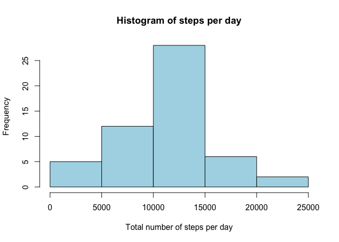
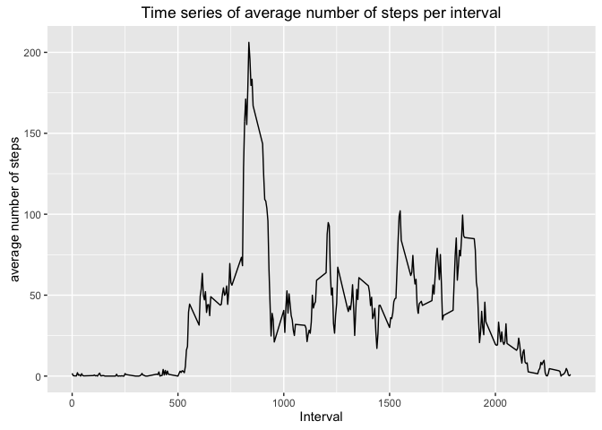
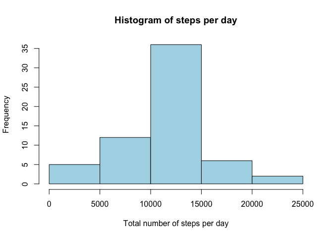

# Reproducible Research: Peer Assessment 1


## Loading and preprocessing the data

In this document, we will be going through an analysis which looks at one specific individual's steps per day, across a 61 day period.

First we need to load the data and have an initial look at the data (make sure it is downloaded to your computer and that your working diretory is correctly set in R):


```r
activity <- read.csv("activity.csv", header = T)
str(activity)
```

```
## 'data.frame':	17568 obs. of  3 variables:
##  $ steps   : int  NA NA NA NA NA NA NA NA NA NA ...
##  $ date    : Factor w/ 61 levels "2012-10-01","2012-10-02",..: 1 1 1 1 1 1 1 1 1 1 ...
##  $ interval: int  0 5 10 15 20 25 30 35 40 45 ...
```

You can see that the dataset consists of three variables: the datae, the number of steps, and the five minute interval in which the steps were taken.

Two things might initially mump out about this dataset: 1.) that there are many missing values for the 'steps' variables, and 2.) that the date is not formatted ideally. We can address the date issue transform that into a friendlier version using the as.Date() function. The missing values will be handled in a later section


```r
activity$date <- as.Date(activity$date, format = "%Y-%m-%d")
```


## What is mean total number of steps taken per day?

## Mean total number of steps per day
Here we will calculate the mean and median of the total number of steps per day.

1. This requires us to first calculate the number of steps taken per day:


```r
day <- tapply(activity$steps, activity$date, sum)
print(as.numeric(day))
```

```
##  [1]    NA   126 11352 12116 13294 15420 11015    NA 12811  9900 10304
## [12] 17382 12426 15098 10139 15084 13452 10056 11829 10395  8821 13460
## [23]  8918  8355  2492  6778 10119 11458  5018  9819 15414    NA 10600
## [34] 10571    NA 10439  8334 12883  3219    NA    NA 12608 10765  7336
## [45]    NA    41  5441 14339 15110  8841  4472 12787 20427 21194 14478
## [56] 11834 11162 13646 10183  7047    NA
```

As you can see the total number of steps per day varies highly, with a minimum of 41 and a maximum of 21190

2. Now we can create a histogram, to see the frequency of steps per day


```r
hist(tapply(activity$steps, activity$date, sum)[1:61], 
     main = "Histogram of steps per day", 
      xlab = "Total number of steps per day", col = "light blue")
```

<!-- -->

3. And now we can calculuate the mean and median of the total number of steps taken per day:


```r
mean(as.numeric(day), na.rm = T); median(as.numeric(day), na.rm = T)
```

```
## [1] 10766.19
```

```
## [1] 10765
```


## What is the average daily activity pattern?

1. A time series plot of the 5-minute interval can show the average number of steps taken in the 288 unique intervals, averaged across all days.
To do this, we will first want to split the dataset into the intervals, and take the mean number of steps for each interval, using the split() and sapply() functions. Then we can create a dataframe using the two variables we want to plot, namely the mean number of steps per interval 'stepsint', and a vector of the unique interval values 'interval'.


```r
int <- split(activity$steps, activity$interval)
stepsint <- sapply(int, mean, na.rm = T)
stepsint <- as.numeric(stepsint)
interval <- unique(activity$interval)
intframe <- data.frame(stepsint, interval)
```

The time series plot can then be constructed as such:


```r
library(ggplot2)
ggplot(intframe, aes(interval, stepsint)) + 
            geom_line() + labs(title = 
            "Time series of average number of steps per interval", 
            x = "Interval", y = "average number of steps")
```

<!-- -->

2. It may also be interesting to know which 5-minute interval across all days contains the highest number of steps taken


```r
which.max(intframe$stepsint)
```

```
## [1] 104
```

```r
intframe[104, ]
```

```
##     stepsint interval
## 104 206.1698      835
```


## Imputing missing values

Assessing the dataset, it can be seen that there are many mising variables for the "steps" variable. These missing values likely lead to some bias for our calculations above.

Let's assess the magnitude of the problem. 
1. We can calculate the number of missing values by looking at the number of incomplete cases


```r
sum(!complete.cases(activity))
```

```
## [1] 2304
```

2. Now that we see we have 2304 missing values, we need to figure out a sensible strategy for imputing these missing values. One strategy could be to use the mean of that specific day, but given that there is great variation throughout the day (e.g. midnight vs. 4pm), this may not be very sensible. 

Instead, we can use the mean for the specific interval. This means that if the value for 3am is missing for a particular day, the mean number of steps for 3am across all other days will be imputed

3. Creating a dataset with the mean for the interval as the imputed value can be done as follows:


```r
actfull <- activity

for (i in 1:288) {
      actfull$steps[actfull$interval == unique(actfull$interval)[i] & 
                  is.na(actfull$steps)] <- 
            mean(actfull$steps[actfull$interval == 
                  unique(actfull$interval)[i]], na.rm = T)
}
```

4. As we did above, we can make a histogram of the total number of steps taken each day, and calculate the mean and median total number of steps taken per day:


```r
hist(tapply(actfull$steps, actfull$date, sum)[1:61], 
     main = "Histogram of steps per day", 
     xlab = "Total number of steps per day", col = "light blue")
```

<!-- -->

And calculate the mean and median total number of steps taken per day:


```r
dayfull <- tapply(actfull$steps, actfull$date, sum)
mean(as.numeric(dayfull), na.rm = T); median(as.numeric(dayfull), na.rm = T)
```

```
## [1] 10766.19
```

```
## [1] 10766.19
```

It is visible on the histogram, that the number of days in which 10000-15000 steps were taken increased considerably.

The mean and median changed only very slightly however, which makes sense, as the values that were imputed were simply excluded previously.


## Are there differences in activity patterns between weekdays and weekends?

We can create a variable identifying whether a given day was a weekday (M-F) or a weekend (Sa, Su):


```r
actfull$weekday[weekdays(actfull$date) %in% c("Saturday", "Sunday")] <- 
      "weekend"
actfull$weekday[!weekdays(actfull$date) %in% c("Saturday", "Sunday")] <- 
      "weekday"
actfull$weekday <- factor(actfull$weekday)
```

One way to evaluate whether the activity patterns are different between weekdays and weekends is to recreate the time-series plot from above, but this time stratified based on weekday or weekend. This can be done as follows:


```r
weekdayset <- actfull[actfull$weekday == "weekday",]
weekendset <- actfull[actfull$weekday == "weekend",]

intday <- split(weekdayset$steps, weekdayset$interval)
intend <- split(weekendset$steps, weekendset$interval)

stepsintday <- sapply(intday, mean, na.rm = T)
stepsintend <- sapply(intend, mean, na.rm = T)

interval <- unique(weekdayset$interval)

intframeday <- data.frame(interval)
intframeend <- data.frame(interval)

intframeday$steps <- as.numeric(stepsintday)
intframeend$steps <- as.numeric(stepsintend)

intframeday$weekday <- rep("weekday", 288)
intframeend$weekday <- rep("weekend", 288)

weekday_frame <- rbind(intframeday, intframeend)
weekday_frame$weekday <- factor(weekday_frame$weekday)

library(lattice)

xyplot(steps ~ interval | weekday, 
       data = weekday_frame, layout = c(1, 2), 
       type = "l")
```

<!-- -->

This is just a quick visual check, but a few possible patterns may be seen, for example:

* On weekdays, the steps began on average much earlier, at approximately 5am, compared to approximately 8am on weekends

* On weekdays, between approximately 8am and 10am, on average more steps were taken than on weekends

* On weekdays, between 10am and 7pm, fewer steps were taken than during weekends

